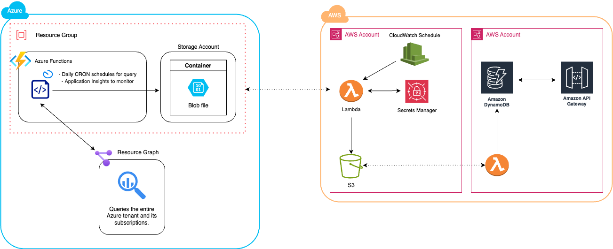

# Azure to AWS Data Pipeline
_Automated pipeline for querying Azure data, storing it in AWS, and making it available via API._


<sub><a href="https://www.vecteezy.com/free-vector/blobfish">Blobfish Vectors by Vecteezy</a></sub>  

## Overview
This pipeline utilizes **Azure Resource Graph** to query Azure data, stores the results in an **Azure Blob Storage** container, and transfers the data to AWS. AWS Lambda functions process the data, store it in **Amazon S3**, and persist it into **DynamoDB** for API consumption.

## 📌 Diagram


## Workflow
1. **Azure Functions**:
   - Runs on a **daily CRON schedule** to execute **Azure Resource Graph queries**.
   - Stores the queried data into an **Azure Blob Storage** container.
   - Uses **Application Insights** for monitoring and logging.
2. **AWS Lambda (Data Fetcher)**:
   - Retrieves the blob file from **Azure Blob Storage**.
   - Stores the data into an **Amazon S3 bucket**.
3. **AWS Lambda (Data Processor)**:
   - Reads the stored data from **Amazon S3**.
   - Inserts the structured data into **Amazon DynamoDB**.
4. **Amazon API Gateway**:
   - Provides a RESTful API to consume the data from **DynamoDB**.
   
## AWS & Azure Services Used
### **Azure Services**
- **Azure Functions** → Automates Azure Resource Graph queries.
- **Azure Resource Graph** → Queries all Azure subscriptions.
- **Azure Blob Storage** → Stores the query results.
- **Application Insights** → Logs and monitors function execution.

### **AWS Services**
- **AWS Lambda** → Handles data extraction, transformation, and storage.
- **Amazon S3** → Stores intermediate data.
- **Amazon DynamoDB** → NoSQL database to persist query results.
- **Amazon API Gateway** → Exposes DynamoDB data as an API.

## 🔧 Setup & Deployment
### 1️. Prerequisites
- Azure and AWS accounts with required IAM permissions.
- AWS CLI and Azure CLI installed and configured.
- Node.js or Python installed for Lambda development.

### 2. Clone the Repository
```sh
git clone https://github.com/<your-org>/<your-repo>
cd <your-repo>
```

### 3. Deploy Azure Function
#### Install dependencies:
```sh
npm install
```

#### Deploy using Azure Functions Core Tools:
```sh
func azure functionapp publish <your-function-app>
```

### 4. Deploy AWS Lambda Functions
#### Using AWS SAM:
```sh
sam build && sam deploy --guided
```
OR
#### Using AWS CDK:
```sh
cdk deploy
```

### 5. API Consumption
Once the pipeline is deployed, you can retrieve data via API Gateway:
```sh
curl -X GET https://<api-gateway-url>/data
```

## 🚀 Execution Stages
| Stage | Service | Description |
|-------|---------|-------------|
| **Query Azure** | Azure Functions | Runs Azure Resource Graph queries and stores data in Blob Storage. |
| **Extract & Store** | AWS Lambda | Retrieves the Blob file and uploads it to S3. |
| **Process & Persist** | AWS Lambda | Reads from S3 and inserts structured data into DynamoDB. |
| **API Access** | API Gateway | Exposes data from DynamoDB via a REST API. |


## 📖 Resources
- [Azure Resource Graph Documentation](https://learn.microsoft.com/en-us/azure/governance/resource-graph/)
- [Azure Functions Documentation](https://learn.microsoft.com/en-us/azure/azure-functions/)
- [AWS Lambda Documentation](https://docs.aws.amazon.com/lambda/latest/dg/welcome.html)
- [Amazon DynamoDB Documentation](https://docs.aws.amazon.com/dynamodb/latest/developerguide/)
- [Amazon API Gateway Documentation](https://docs.aws.amazon.com/apigateway/latest/developerguide/welcome.html)

